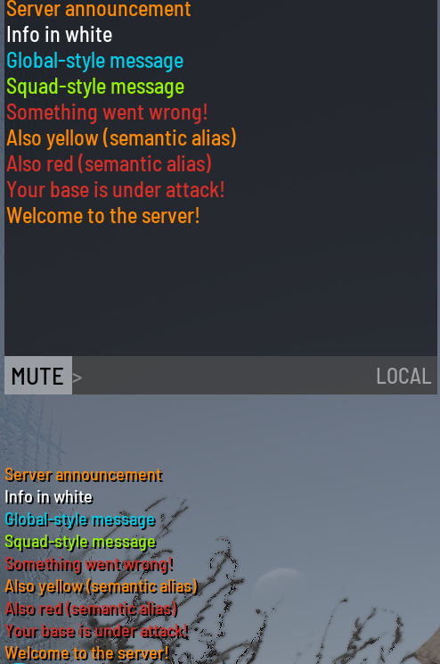

# Commands

Commands are sent via [POST /command](http-api.md#post-command) (HTTP) or `SERVERDATA_EXECCOMMAND` (RCON).

The leading `#` is optional for ggCON-specific commands but is required for native SCUM admin commands.

## How commands are executed

Native SCUM admin commands require at least one player to be online — ggCON runs each command through whichever player is currently available on the server. No dedicated admin account is required; any online player will do, though you can restrict or prefer specific players using the [executor selection settings](config-reference.md#executor-selection).

This has three important implications:

**Commands appear in SCUM's admin log under that player's name.** Depending on your [executor selection settings](config-reference.md#executor-selection), this may be a specific player you've configured or simply whoever happens to be online.

**Context-sensitive commands act on the executing player if no target is specified.** For example:

```
#SpawnItem Backpack_Tactical_01 1
```

This spawns the item on whichever player ggCON is currently running commands through — which may not be who you intended. Always use the targeted form with an explicit Steam ID:

```
#SpawnItem 76561198000000001 Backpack_Tactical_01 1
```

This applies to any command that accepts an optional player argument. When in doubt, check the SCUM admin command reference and always supply the target Steam ID.

**The player being used will see the command output in their in-game chat.** Any `#ListPlayers` result, economy query, or automated command output will appear on that player's screen. Enable [`SuppressCommandOutput`](config-reference.md#suppresscommandoutput) to prevent this — it is recommended for most setups.

!!! tip "Restrict the executor"
    Use `RestrictToAdmins` and `PreferredSteamIDs` in the panel's **Settings** tab to control which player's account commands run under. See [Executor selection](config-reference.md#executor-selection).

---

## ggCON commands

These commands are handled directly by the mod and do not pass through to the game.

### #ListPlayersJson

Returns the live player list as structured JSON — the same response as [GET /players.json](http-api.md#get-playersjson). Includes rich fields per player: SteamID, location, fame, balance, admin status, gear weight, and more.

```
#ListPlayersJson
```

Compare with the native `#ListPlayers` command, which returns plain text lines captured directly from the game:

=== "#ListPlayersJson"

    ```json
    {
      "ok": true,
      "count": 2,
      "players": [
        {
          "characterName": "ShadowWolf",
          "steamName": "ShadowWolf_99",
          "userId": "76561198011111111",
          "fame": 150,
          "accountBalance": 2400,
          "goldBalance": 5,
          "location": { "x": -145230, "y": 87420, "z": 12300.5 },
          "isAdmin": false,
          "fameLevel": 1,
          "ping": 34,
          "isGodMode": false,
          "isImmortal": false,
          "hasInfiniteAmmo": false,
          "isSuperJumpEnabled": false,
          "gearWeightKg": 12.8,
          "ipAddress": "198.51.100.25",
          "gender": "male",
          "itemInHands": "1H_KitchenKnife_02_Deluxe",
          "velocity": { "x": 293.6, "y": -196.1, "z": 0 },
          "health": 1.0,
          "bodyEffects": [],
          "squad": { "name": "Alpha Squad", "members": 4 },
          "attributes": {
            "strength": 5.0,
            "constitution": 5.0,
            "dexterity": 5.0,
            "intelligence": 5.0
          },
          "skills": [
            { "id": 1, "name": "Rifles", "xp": 450, "level": 2, "levelName": "Medium" }
          ]
        },
        {
          "characterName": "GhostSniper",
          "steamName": "Ghost_Sniper",
          "userId": "76561198033333333",
          "fame": 3200,
          "accountBalance": 15000,
          "goldBalance": 50,
          "location": { "x": -302664, "y": 24774, "z": 35800.8 },
          "isAdmin": true,
          "fameLevel": 4,
          "ping": 12,
          "isGodMode": false,
          "isImmortal": false,
          "hasInfiniteAmmo": false,
          "isSuperJumpEnabled": false,
          "gearWeightKg": 4.64,
          "ipAddress": "203.0.113.42",
          "gender": "female",
          "itemInHands": null,
          "velocity": { "x": 0, "y": 0, "z": 0 },
          "health": 0.85,
          "bodyEffects": [
            { "name": "Exhaustion", "severity": 0, "maxSeverity": 2 }
          ],
          "squad": null,
          "attributes": {
            "strength": 8.0,
            "constitution": 5.0,
            "dexterity": 5.0,
            "intelligence": 5.0
          },
          "skills": [
            { "id": 5, "name": "Sniper Rifles", "xp": 980, "level": 3, "levelName": "Advanced" }
          ]
        }
      ]
    }
    ```

=== "#ListPlayers (native)"

    ```json
    {
      "ok": true,
      "accepted": true,
      "dispatched": true,
      "command": "#ListPlayers",
      "lines": [
        "\n 1. ShadowWolf\nSteam: ShadowWolf_99 (76561198011111111)\nFame: 150                  \nAccount balance: 2400\nGold balance: 5\nLocation: X=-145230.000 Y=87420.000 Z=12300.500\n",
        "\n 2. NightRaven\nSteam: NightRaven (76561198022222222)\nFame: 820                  \nAccount balance: 0\nGold balance: 0\nLocation: X=56780.000 Y=-33410.000 Z=8900.000\n",
        "\n 3. GhostSniper\nSteam: Ghost_Sniper (76561198033333333)\nFame: 3200                  \nAccount balance: 15000\nGold balance: 50\nLocation: X=-302664.000 Y=24774.000 Z=35800.789\n"
      ]
    }
    ```

Use `#ListPlayersJson` when you need structured data for automation. Use `#ListPlayers` when you want the raw game output.

---

### #Broadcast

Sends a message to all players currently on the server.

```
#Broadcast [type] <text>
```

| Parameter | Required | Description |
|---|---|---|
| `type` | No | Message color. See [Message types](http-api.md#message-types). Defaults to `Yellow` |
| `text` | Yes | Message text |

**Examples:**

```
#Broadcast Yellow Server announcement
#Broadcast White Info in white
#Broadcast Cyan Global-style message
#Broadcast Green Squad-style message
#Broadcast Red Something went wrong!
#Broadcast ServerMessage Also yellow (semantic alias)
#Broadcast Error Also red (semantic alias)
```

**Response:**

```json
{ "ok": true, "sent": true, "message": "" }
```

**Result:**



---

### #MessagePlayer

Sends a private message to a single player.

```
#MessagePlayer <steamId> [type] <text>
```

| Parameter | Required | Description |
|---|---|---|
| `steamId` | Yes | The target player's 64-bit Steam ID |
| `type` | No | Message color. Defaults to `Yellow` |
| `text` | Yes | Message text |

**Examples:**

```
#MessagePlayer 76561198031234567 Red Your base is under attack!
#MessagePlayer 76561198031234567 Yellow Welcome to the server!
```

**Response:**

```json
{ "ok": true, "sent": true, "message": "" }
```

---

### #ExecAs

Dispatches any admin command in the context of a specific player. Use this when a command has no explicit target argument and acts on the executing player by default.

```
#ExecAs <steamId> <command>
```

| Parameter | Required | Description |
|---|---|---|
| `steamId` | Yes | The 64-bit Steam ID of the player to execute the command as |
| `command` | Yes | Any admin command, including the leading `#` |

**Examples:**

```
#ExecAs 76561198031234567 #SetAttributes 8 5 5 5
#ExecAs 76561198031234567 #SpawnItem Backpack_Tactical_01 1
#ExecAs 76561198031234567 #SetMetabolismSimulationSpeed 10
```

The target player must be online. If they are not, the command is rejected:

```json
{
  "ok": false,
  "accepted": false,
  "dispatched": false,
  "command": "#ExecAs 76561198031234567 #SetAttributes 8 5 5 5",
  "message": "Target player not online"
}
```

!!! note
    `#ExecAs` overrides [executor selection settings](config-reference.md#executor-selection) for the duration of that single command. The target player temporarily becomes the executor, so any command that acts on "the running player" will act on them.

!!! tip "No admin status required"
    The target player does not need to be an admin or have any elevated permissions. ggCON handles command dispatch internally, bypassing the normal in-game permission checks. Any online player can be used as the executor.

---

### #SetPlayerAttributes

Shorthand for `#ExecAs <steamId> #SetAttributes <args>`. Sets the physical attributes of a specific player.

```
#SetPlayerAttributes <steamId> <strength> <constitution> <dexterity> <intelligence>
```

| Parameter | Required | Description |
|---|---|---|
| `steamId` | Yes | The target player's 64-bit Steam ID |
| `strength` | Yes | Strength value (1–10) |
| `constitution` | Yes | Constitution value (1–10) |
| `dexterity` | Yes | Dexterity value (1–10) |
| `intelligence` | Yes | Intelligence value (1–10) |

**Example:**

```
#SetPlayerAttributes 76561198031234567 8 5 5 5
```

This is exactly equivalent to:

```
#ExecAs 76561198031234567 #SetAttributes 8 5 5 5
```

The `#SetAttributes` command has no Steam ID parameter — it acts on the player running it. `#SetPlayerAttributes` exists so you don't have to think about that.

---

### #GiveItem

Spawns an item for a specific player. The item appears near the player's location.

```
#GiveItem <steamId> <itemName> [quantity]
```

| Parameter | Required | Description |
|---|---|---|
| `steamId` | Yes | The target player's 64-bit Steam ID |
| `itemName` | Yes | The item class name (e.g., `Backpack_Tactical_01`, `Knife_Hunting`) |
| `quantity` | No | Number of items to spawn (default: 1) |

**Examples:**

```
#GiveItem 76561198031234567 Backpack_Tactical_01 1
#GiveItem 76561198031234567 Knife_Hunting 3
#GiveItem 76561198031234567 Ammo_Rifle_556x45_30rnd
```

**Response:**

```json
{
  "ok": true,
  "accepted": true,
  "dispatched": true,
  "command": "#GiveItem 76561198031234567 Backpack_Tactical_01 1"
}
```

The target player must be online. Use [GET /items.json](http-api.md#get-itemsjson) to browse all available item names, or use the web panel's [Give Item](web-panel.md#give-item) feature for a searchable UI.

!!! tip "No database modifications"
    Items are spawned directly in the game world near the player. No database changes are made, and the operation works with any item in the game.

---

### #ReloadConfig

Reloads all configuration files (`ggCON.ini`, `ggcon_settings.json`, `ggcon_password`) and re-applies settings without restarting the server.

```
#ReloadConfig
```

**Response:**

```json
{ "ok": true, "message": "Config reloaded" }
```

The following settings take effect immediately on reload:

- Authentication — password, allowed IPs/CIDRs
- Executor selection — `RestrictToAdmins`, `PreferredSteamIDs`
- Command filtering — `LimitAdminCommands`, `AllowedCommandsFile`
- Logging — `LogMinSeverity`, `DiscordLogWebhook`, `DiscordAuditWebhook`

The following settings require a full server restart to change:

- `Port`, `BindAddress` — HTTP server is already bound
- `RconEnabled`, `RconPort`, `RconBindAddress` — RCON server is already started or not

---

### #Server

Returns server state as structured JSON — the same response as [GET /server.json](http-api.md#get-serverjson).

```
#Server
```

**Response:**

```json
{
  "ok": true,
  "online": true,
  "modVersion": "0.2.0",
  "scumVersion": "1.2.1.1.106289+0",
  "onlinePlayers": 3,
  "timeOfDay": 14.5
}
```

---

### #Weather

Returns live weather and environment data as structured JSON — the same response as [GET /weather.json](http-api.md#get-weatherjson).

```
#Weather
```

**Response:**

```json
{
  "ok": true,
  "timeOfDay": 15.32,
  "sunriseTime": 6,
  "sunsetTime": 21,
  "rainIntensity": 0,
  "snowIntensity": 0,
  "windAzimuth": 307.169,
  "windIntensity": 0.025,
  "windSpeedKph": 5.03,
  "airTemperature": 34.94,
  "waterTemperature": 25,
  "humidity": 0.025,
  "fogDensity": 0.38,
  "lightningRate": 0,
  "nighttimeDarkness": 0,
  "cirrostratusCoverage": 0,
  "cumulonimbusCoverage": 0.12,
  "nimbostratusCoverage": 0
}
```

---

## Native SCUM admin commands

All other commands are forwarded directly to the SCUM admin command system. Any command that works for an in-game admin will work here.

**Examples:**

```
#ListPlayers
#ListSquads
#ListBodyEffects 76561198000000001
#SetFamePoints 76561198000000001 5000
#GiveMoney 76561198000000001 1000
#SpawnItem 76561198000000001 Backpack_Tactical_01 1
#Broadcast Hello from the server!
#SetTime 12 00
```

Output lines from the game (if any) are returned in the `lines` array of the response.

---

### #SendNotification

Sends a notification to one or all players using different display styles.

```
#SendNotification <type> <userId> "<message>"
```

| Parameter | Required | Description |
|---|---|---|
| `type` | Yes | Notification style (see table below) |
| `userId` | Yes | Target player's Steam64 ID, or `-1` for all players |
| `message` | Yes | Notification text. Must be in quotes for multi-word messages |

**Notification types:**

| Type | Style | Location |
|---|---|---|
| 1 | Basic | Top-right corner |
| 2 | Warning | Center of screen |
| 4 | HUD | Bottom-left |
| 5 | KillFeed | Bottom-center |

Type 3 (LevelUp) is not useful as it ignores the message text.

**Examples:**

```
#SendNotification 2 -1 "Server restarting in 5 minutes!"
#SendNotification 1 76561198000000003 "You have a new quest!"
#SendNotification 5 -1 "Admin alert"
```

!!! tip "Use the web panel for more options"
    The web panel's Chat tab provides a more user-friendly interface for sending notifications with additional options such as custom colors, display duration, and sound toggle. See [Web Panel](web-panel.md#chat).

---

## Developer commands

SCUM includes a set of developer-level commands — commands such as `#SetAttributes`, `#SetSkillLevel`, `#Knockout`, `#SetImmortality`, and `#SetMetabolismSimulationSpeed` — that are normally restricted to elevated users configured directly in the server database.

**ggCON supports these commands out of the box.** No database modifications or elevated user configuration is required. Send them the same way as any other admin command:

```
#SetSkillLevel 76561198000000001 Rifles 3
#ExecAs 76561198000000001 #SetAttributes 8 5 5 5
#Knockout 76561198000000001 10
#SetImmortality 76561198000000001 true
#SetMetabolismSimulationSpeed 10
```

!!! note
    `#SetAttributes` has no Steam ID parameter — it acts on the executing player. Use [`#ExecAs`](#execas) or [`#SetPlayerAttributes`](#setplayerattributes) to target a specific player.

---

## Command filtering

If `LimitAdminCommands = true` is set in your config, only commands listed in `ggCON_allowed_commands.txt` will be accepted. Commands not in the list are rejected before reaching the game:

```json
{
  "ok": false,
  "accepted": false,
  "dispatched": false,
  "command": "#KickPlayer 76561198000000001",
  "message": "command not in allowed list"
}
```

See the [Config Reference](config-reference.md#command-filtering) for details.
