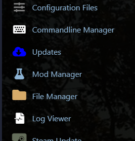
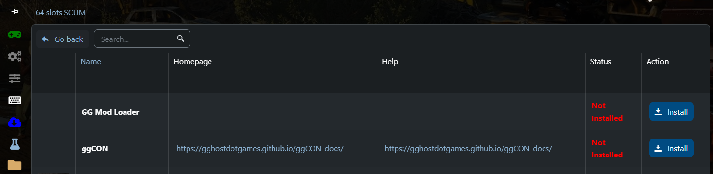
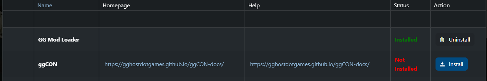
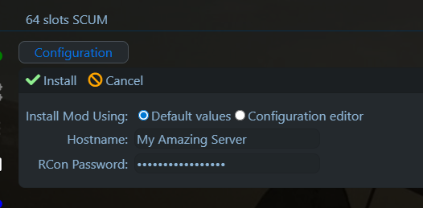
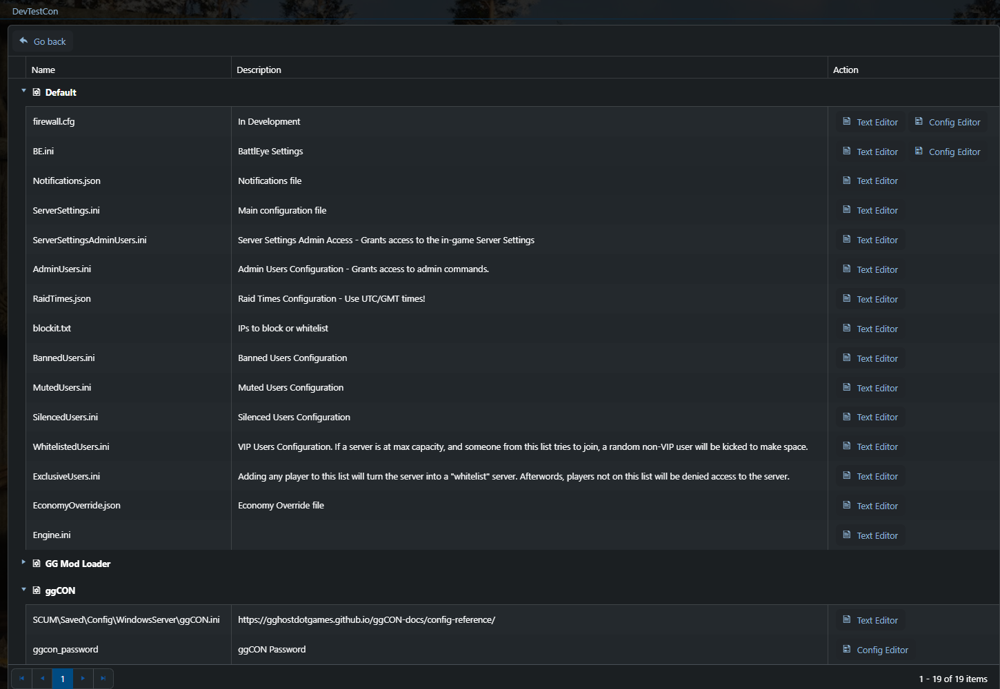
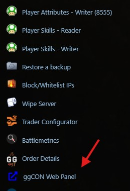

# Getting Started

## Requirements

- A [GG Host SCUM Server](https://www.gghost.games/store/scum-server){target=_blank}

## Installation

### 1. Open Mod Manager

In your GG Host game panel, navigate to **Mod Manager** in the left sidebar.



### 2. Install GG Mod Loader

ggCON requires the **GG Mod Loader** to be installed first. Click **Install** next to GG Mod Loader and wait for it to complete.



Once GG Mod Loader shows "Installed", you can proceed to install ggCON.



### 3. Install ggCON

Click **Install** next to **ggCON**. You will be prompted to enter a strong **RCon Password** — this is the password you will use to access the web panel and API.



Click the green **Install** checkmark to confirm.

### 4. Set your password

After installation, go to **Configuration Files** in the left sidebar. Under the **ggCON** section at the bottom, click **Config Editor** next to `ggcon_password.ini`.



Enter a strong password and save. This is the only configuration required — ggCON ships with sensible defaults and all other settings can be managed through the web panel once you're logged in.

### 5. Start your server

Start (or restart) your SCUM server. ggCON will activate automatically.

## Access the web panel

The easiest way to open the panel is from the **ggCON Web Panel** shortcut in the left sidebar of your GG Host game panel — it logs you in automatically.



You can also access it directly at:

```
https://ggcon.gghost.games/s/<serviceId>/panel
```

All settings — IP restrictions, command filtering, logging, Discord webhooks, and more — can be configured from the panel's **Settings** tab.

See [Web Panel](web-panel.md) for full documentation.

## Verify the mod is running

You can also test the health endpoint directly. Replace `<serviceId>` with your service ID (the same value as in your panel URL above):

```bash
curl https://ggcon.gghost.games/s/<serviceId>/health
```

Expected response:

```json
{
  "ok": true,
  "mod": "ggCON",
  "version": "0.13.13",
  "build": "YYYY-MM-DD HH:MM",
  "service": "http",
  "running": true
}
```

(Your version will match whatever build your server is running.)

## Make your first API call

Fetch the current player list:

```bash
curl -H "X-Password: yourpassword" https://ggcon.gghost.games/s/<serviceId>/players.json
```

Run an admin command:

```bash
curl -X POST \
     -H "X-Password: yourpassword" \
     -H "Content-Type: application/json" \
     -d '{"command": "#ListPlayers"}' \
     https://ggcon.gghost.games/s/<serviceId>/command
```

## Enabling RCON

To also accept RCON connections (compatible with mcrcon and similar clients), add to your `ggCON.ini`:

```ini
RconEnabled = true
RconPort    = 27020
```

!!! note "Two separate ports"
    ggCON uses two different ports: the HTTP port for the web panel and API, and `RconPort` for RCON clients. The panel and API are reached through `https://ggcon.gghost.games/s/<serviceId>/`, while RCON connects directly to your server's IP and RCON port (it does not go through the proxy). On GG Host servers the RCON port is usually your HTTP/panel port + 1.

See the [RCON](rcon.md) page for client setup instructions.
