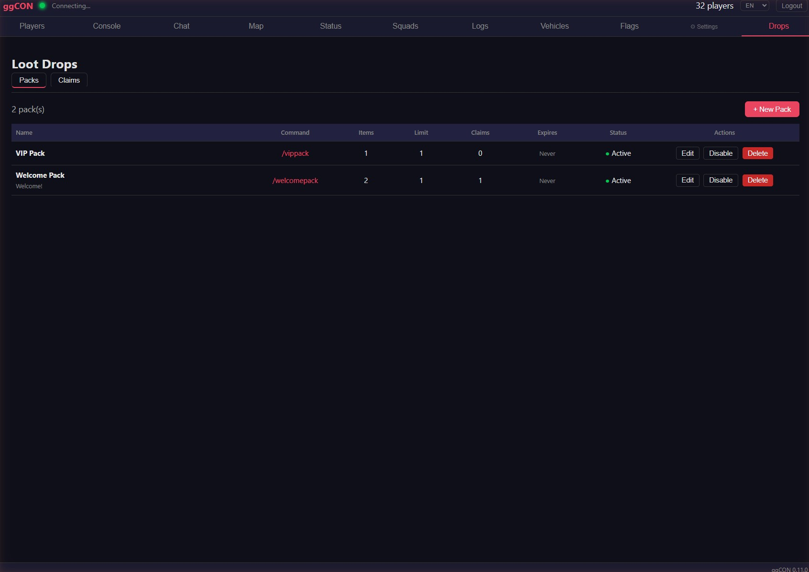

# Plugins

ggCON supports a plugin system that lets you extend the mod with additional features. Plugins are standalone modules that live in a `plugins/` folder alongside the main ggCON DLL and are loaded automatically on startup.

## How Plugins Work

Each plugin can:

- **Add a panel tab** — custom HTML UI that appears as a new tab in the web panel
- **Register HTTP routes** — add new API endpoints accessible via the ggCON HTTP API
- **Register slash commands** — add in-game chat commands (e.g. `/starter`) that players can use
- **React to events** — respond when players join, leave, or send chat messages
- **Execute commands** — run admin commands and spawn items through the host API
- **Send notifications** — deliver chat messages, warnings, and HUD overlays to players

## Version Compatibility

Plugins can declare a minimum ggCON version in their metadata. If your installed ggCON version is older than what a plugin requires, the Plugin Manager will show a **"Requires vX.Y.Z+"** notice and block installation until you update ggCON.

---

## Available Plugins

### Loot Drops

Configurable item drop packs with slash commands, per-player allowlists, and claim limits.

- **Drop packs** — create bundles of items that players can claim with a slash command (e.g. `/starter`, `/event-drop`)
- **Per-player limits** — set how many times each player can claim a pack (e.g. once per wipe)
- **Allowlists** — optionally restrict packs to specific Steam IDs
- **Expiry dates** — set an expiry time after which the pack is no longer claimable
- **Panel management** — create, edit, enable/disable, and delete packs from the Loot Drops tab in the web panel
- **Claim tracking** — view all player claims with timestamps; clear claims in bulk (e.g. after a server wipe)
- **Smart delivery** — items are queued and spawned one per tick to prevent server overload



**Slash commands:** Each pack registers its own command (configurable). Players type the command in chat to claim.

**Requires:** ggCON v0.11.0+

---

### Log Analyzer

Server performance analytics — replaces the standalone ServerLogAnalyzer desktop tool.

- **Analytics tab** — 10 interactive time-series charts: FPS, frame time, character count, prisoner count, zombie count, animal count, vehicle count, and more
- **Summary cards** — at-a-glance stats including average FPS, minimum FPS, peak zombies, peak animals, and sample count
- **Time range selector** — view data over the last 1 hour, 6 hours, 24 hours, or 7 days
- **Load Log button** — triggers incremental log read on demand
- **Persistent history** — up to 7 days of minute-resolution data retained across restarts

---

### Kill Feed

Real-time kill event feed for PvP, NPC, trap, and suicide kills.

- **Kill list** — scrollable feed showing killer, victim, weapon, distance, and kill type (PvP, NPC, Trap, Suicide)
- **Weapon icons** — dynamic icon lookup from the item catalog with a manual fallback table for common weapons
- **Detail strip** — expanded view of the selected kill event with full player info
- **Interactive map** — shows killer and victim positions with markers
- **LIVE / PAUSED mode** — auto-follow new events in LIVE mode, or freeze the list to inspect past events
- **Session clear** — kill history resets automatically when the server restarts

**Requires:** ggCON v0.11.6+

---

### Trap Feed

Real-time trap event feed showing crafting, arming, disarming, and triggering of traps.

- **Event list** — scrollable feed of trap events with player name, trap type, and action (Crafted, Armed, Disarmed, Triggered)
- **Trap icons** — trap-specific icons for each trap type
- **Detail strip** — expanded view of the selected event
- **Interactive map** — shows trap locations with markers
- **LIVE / PAUSED mode** — auto-follow new events or freeze the list

**Requires:** ggCON v0.11.6+

---

### Quarter Master

In-game item shop with a web storefront and dual currency support.

- **Admin panel** — create and manage item packages with categories, prices, stock limits, and discounts from the Quarter Master tab in the web panel
- **Player storefront** — players visit `shop.gghost.games`, log in with their Steam ID and PIN, browse packages, and purchase items
- **Dual currency** — packages can be priced in both in-game rations and money; players pay with whatever the admin sets
- **Stash system** — purchases go to a persistent stash; players claim items from the storefront when in-game; supports purchasing while offline
- **Discounts** — admins can set percentage discounts with optional expiry dates on packages
- **Stock limits** — optional per-package stock limits; storefront shows remaining stock or "Sold Out" badge
- **Delivery safety** — items that fail to spawn (e.g., player logs out mid-delivery) return to the stash for re-claiming
- **Server directory** — the `shop.gghost.games` landing page lists all registered servers with their shop name and status
- **Slash command** — players type `/shop` in-game to get their storefront URL

**Requires:** ggCON v0.11.8+

---

## Coming Soon

### AI NPCs

AI-powered NPC characters that interact with players in chat using Claude. Replaces the built-in NPC system with a standalone plugin.

- Configure trigger words (e.g., `@warden`) and NPC personalities
- NPCs respond to player chat messages with context-aware replies
- NPCs can execute admin commands (with optional per-NPC command allowlists)
- Per-player conversation history
- Configurable model, token limits, and response cooldowns

See [NPC System](npc-system.md) for details on the current built-in version.

---

## Marketplace

The plugin marketplace lets you install, update, and uninstall plugins directly from the web panel — no manual file management needed.

### Accessing the Marketplace

1. Open the web panel
2. Click the **gear icon** in the navigation bar
3. Select **Plugins**

The marketplace shows all available plugins with their current status:

- **Install** — download and install a plugin
- **Update** — update an installed plugin to the latest version (shown when an update is available)
- **Uninstall** — remove an installed plugin
- **Requires vX.Y.Z+** — shown when a plugin needs a newer ggCON version; update ggCON first

Plugin changes take effect on the next server restart.


---

## Plugin Configuration

Plugins can read configuration from `ggCON.ini` using section headers in the format `[Plugin:<id>]` (requires a server restart):

```ini
[Plugin:log-analyzer]
SomeKey = SomeValue
```

Refer to each plugin's documentation for its specific configuration options.
