# Web Panel

ggCON includes a built-in web panel for managing your SCUM server from any browser. No additional software or setup is required — the panel is served directly by ggCON.

## Accessing the Panel

For GG Host servers, the quickest way is the **ggCON Web Panel** shortcut in the left sidebar of your game panel — it logs you in automatically.

You can also access the panel directly over HTTPS:

```
https://ggcon.gghost.games/s/<panelId>/panel
```

!!! tip "Bookmarkable login"
    You can include your password in the URL for one-click access: `https://ggcon.gghost.games/s/<panelId>/panel?pw=yourpassword`. The password is stripped from the browser's address bar after login.

You will be prompted to enter your ggCON password (the value stored in your `ggcon_password` file).

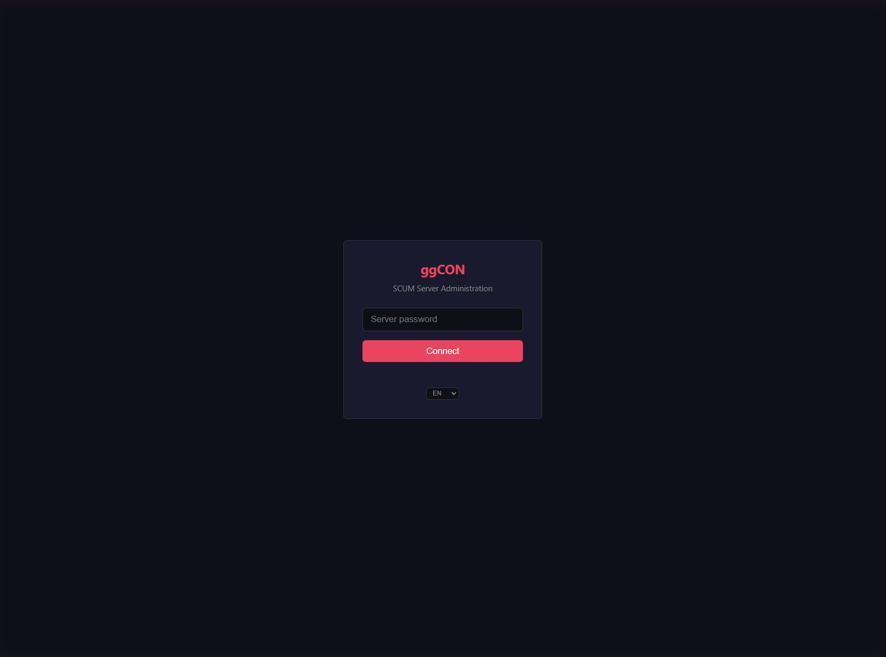

!!! note
    The panel uses the same IP allowlist and password authentication as the HTTP API. If you cannot reach the panel, verify your IP is in the `AllowedIPs` or `AllowedCIDRs` list, or that `AllowAllIPs` is enabled. When using the SSL proxy, IP allowlists apply to the original client IP.

---

## Tabs

### Players

Lists all online players with sortable columns:

| Column | Description |
|---|---|
| Name | SCUM in-game character name |
| Steam | Steam profile name |
| Steam ID | 64-bit Steam ID (clickable — opens Steam profile) |
| Fame | Fame points |
| Ping | Network latency |
| Flags | Admin, God Mode, Immortal, Dead, Drone badges |
| Actions | MSG (send message) and #ExecAs (run command as player) |

**Click any player row** to open a detailed popup.

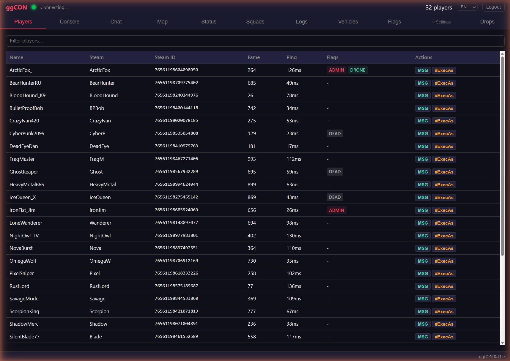

### Player Detail Popup

Click a player in the list or on the map to see full details:

- **Online/offline indicator** — green glowing dot for online players, red glowing dot for offline players
- **Character** — health bar, movement speed (m/s), item in hands, gender, gear weight
- **Connection** — ping, IP address
- **World** — world coordinates, map location
- **Economy** — fame (with level), cash balance, gold balance — each with inline edit buttons (Set, +, -)
- **Conditions** — active body effects with severity (exhaustion, illness, etc.)
- **Skills & Attributes** — 27 skills grouped by attribute (Strength, Constitution, Dexterity, Intelligence) with level and XP; base attribute values displayed as headers
- **Squad** — if the player belongs to a squad, the squad name is shown and clickable (navigates to the Squads tab)
- **Steam Profile** — clickable Steam ID link opens the player's Steam profile

**Actions:**

- **Send Message** — send a private in-game message to the player
- **#ExecAs** — execute a command in the context of the player
- **Give Item** — opens the item picker to spawn items for the player (see [Give Item](#give-item))
- **Show on Map** — switches to the Map tab and flies to the player's location
- **Teleport To...** — opens the map in teleport mode (see [Teleport from Map](#teleport-from-map))
- **Kick** — kicks the player from the server (with confirmation dialog)
- **Ban** — bans the player from the server (with confirmation dialog)

The popup updates in real-time as new data is polled from the server.

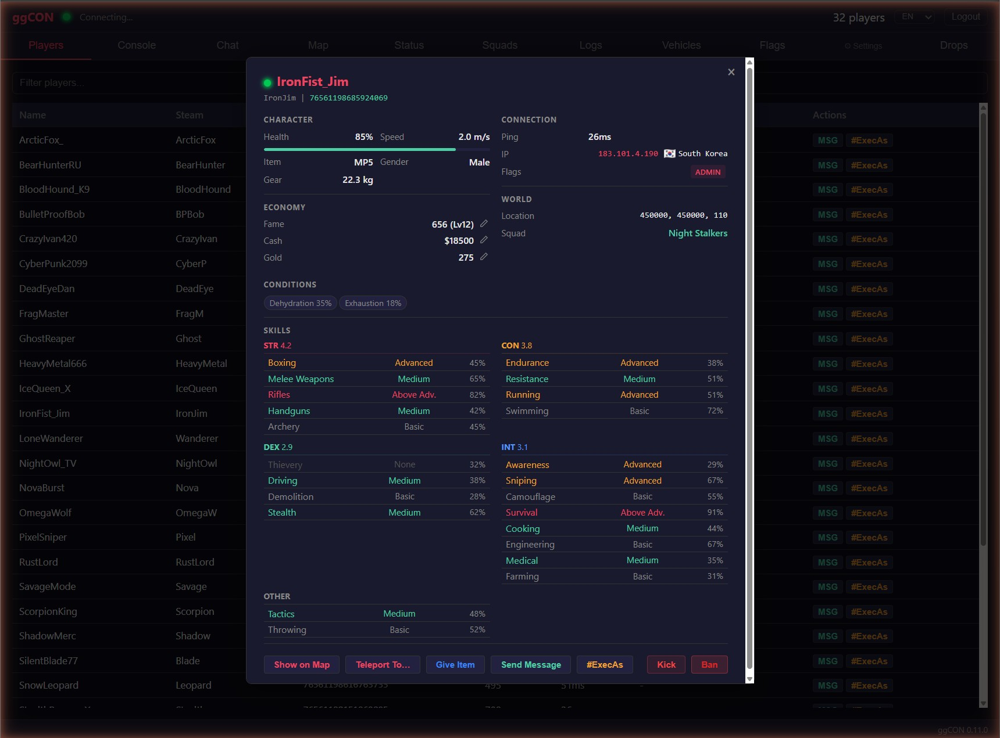

#### Economy Controls

Each economy field (Fame, Cash, Gold) has inline edit buttons:

- **Set** — set to an exact value
- **+** — add an amount
- **-** — subtract an amount

Enter the value and confirm. The change is applied immediately via the REST API.

### Offline Player Card

Clicking any player name throughout the panel (in the Flags, Vehicles, or Squads tabs) when that player is not currently online opens a minimal player card with available information:

- Player name and Steam ID
- Online/offline status indicator (red dot)
- Owned flags and flag count
- Owned vehicles
- Squad membership

This allows you to look up player details even when they are not connected to the server.

### Console

Interactive admin command console. Type any SCUM admin command and see the response.

- **Autocomplete** — commands are suggested as you type; press Tab, Enter, or click to complete; arrow keys to navigate suggestions
- **ggCON vs SCUM badges** — commands are labelled so you can tell at a glance whether a command is a ggCON command or a native SCUM admin command
- **Argument completion** — after selecting a command, the next argument is suggested automatically: online players for player args, and the full item, vehicle, zombie, and animal catalogs for spawn-type args
- **Required / optional arg hints** — free-text arguments show whether they are required or optional as you fill them in
- **SCUM command warning** — a warning appears when typing a native SCUM command directly, linking to `#ExecAs` for targeted execution
- Command history with up/down arrow keys
- Color-coded output (commands, responses, errors)
- Supports all ggCON and native SCUM commands

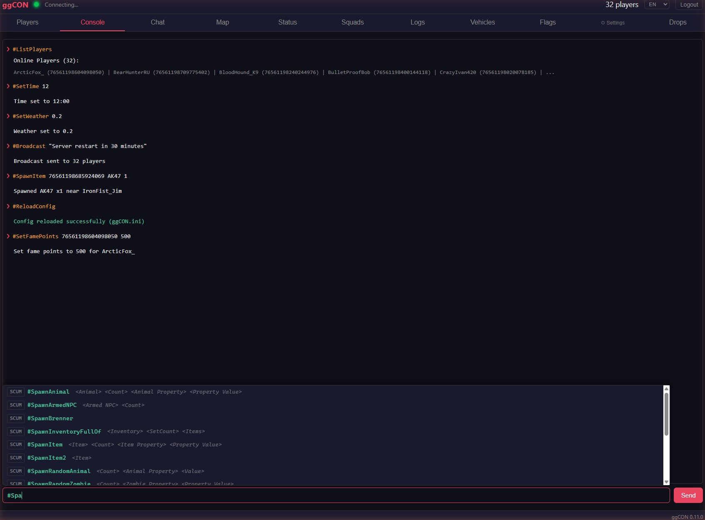

### Chat

Real-time chat viewer showing all in-game chat messages. Requires `LogWatcherEnabled = true` in your config.

- **Channel colors** — messages are tagged with colored pills matching in-game colors: white (Local), blue (Global), green (Squad), gold (Admin), gray (System)
- **Clickable player names** — click a player's name to open their detail popup
- **Broadcast input** — type a message and click Broadcast to send to all players

**Method dropdown** — select the notification delivery method:

| Method | Description |
|---|---|
| Chat | Standard in-game chat message. Choose a color from the color picker (Yellow, White, Cyan, Green, Red) |
| Warning | Center-screen notification. Choose a custom color from the color picker and set display duration in seconds |
| Kill Feed | Bottom-center notification with prefix, name, and suffix fields. Toggle the sound on or off |

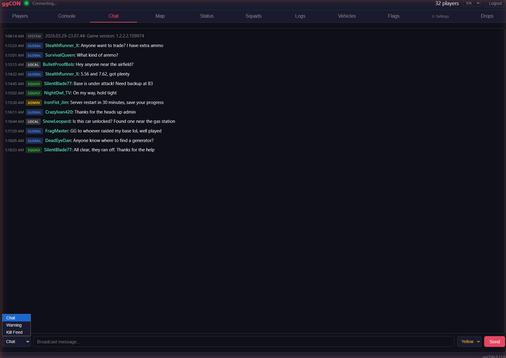

### Map

Live map showing player and vehicle positions on the SCUM island. The map uses a 14K tiled image with 7 zoom levels for smooth navigation.

**Players:**

- **Player dots** — green for regular players, red for admins
- **Name labels** — toggle with the "Names" checkbox
- **Click a player dot** to open their detail popup

**Vehicles:**

- **Vehicle markers** — blue squares for all vehicles, orange for rendered (near players)
- **Vehicle checkbox** — toggle vehicle markers on/off
- **Type filter** — dropdown next to the Vehicles checkbox filters markers by vehicle class (e.g., "Barba", "Rager"). The list is populated dynamically from the server's vehicle data with counts per type
- **Click a vehicle marker** to see vehicle details

**Flags:**

- **Flag markers** — flag icon markers showing base locations
- **Flags checkbox** — toggle flag markers on/off in the map toolbar
- **Click a flag marker** to see flag details (owner, base name, element count, location)

**Measurement tool:**

- Click the ruler/measure button in the map toolbar to enter measurement mode
- First click places point A, second click places point B
- Displays distance in meters (or km for distances over 1,000 m) with a dashed line between points
- Click again to start a new measurement
- Press **Escape** or click the measure button again to exit measurement mode

**Right-click menu:**

- **Right-click anywhere on the map** to open a context menu
- **Copy Coordinates** — copies the world coordinates at that location
- **Teleport Player** — teleport any online player to the clicked location

**Map controls:**

- **Layers dropdown** — floating panel with toggle switches for each layer (Players, Names, Vehicles, Flags, Grid) with green dot indicators for active layers
- **Marker size slider** — adjust the size of player and vehicle markers
- **Mouse coordinates** — world coordinates shown as you move the cursor

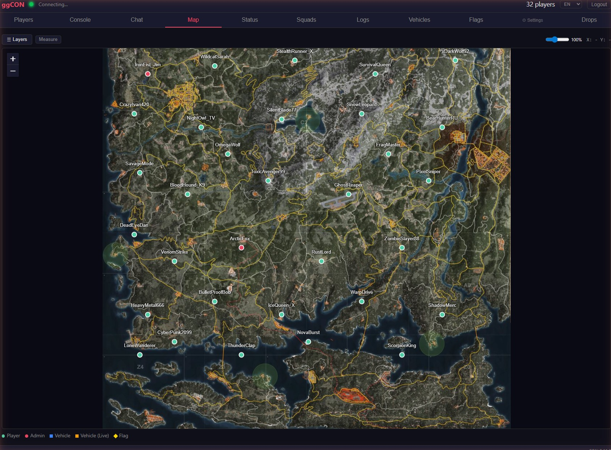

### Vehicles

Full vehicle list with sortable columns and filtering.

**Columns (click to sort A→Z / Z→A):**

| Column | Description |
|---|---|
| ID | Vehicle entity ID |
| Name | Vehicle class name. Green dot indicates the vehicle is rendered (near a player) |
| Owner | Owner's character name, or "None" if unowned |
| Location | World coordinates (X, Y) |
| Actions | Details button to open vehicle popup |

**Filter bar** — type to filter vehicles by name, owner, or ID.

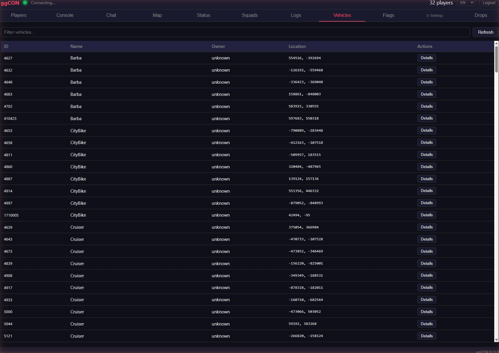

**Vehicle detail popup:**

- Vehicle ID, class, and owner
- World coordinates
- Spawn date (when the vehicle was spawned)
- Live/database position indicator
- **Show on Map** — switches to the Map tab and flies to the vehicle's location
- **Destroy Vehicle** — destroys the vehicle (with confirmation dialog)
- **Show Owner** — opens the owner's player detail popup (if owner is online) or offline card

### Flags

Searchable list of all base building flags on the server.

| Column | Description |
|---|---|
| Flag ID | Unique flag identifier |
| Owner | Owner's character name (clickable — opens player detail popup) |
| Base Name | Name of the base |
| Location | World coordinates (X, Y) |
| Elements | Current / maximum building elements |
| Expanded | Number of expanded elements |

**Filter bar** — type to filter flags by owner name, base name, or flag ID.

**Refresh button** — forces an immediate reload of flag data.

Flag data auto-refreshes every 30 seconds.

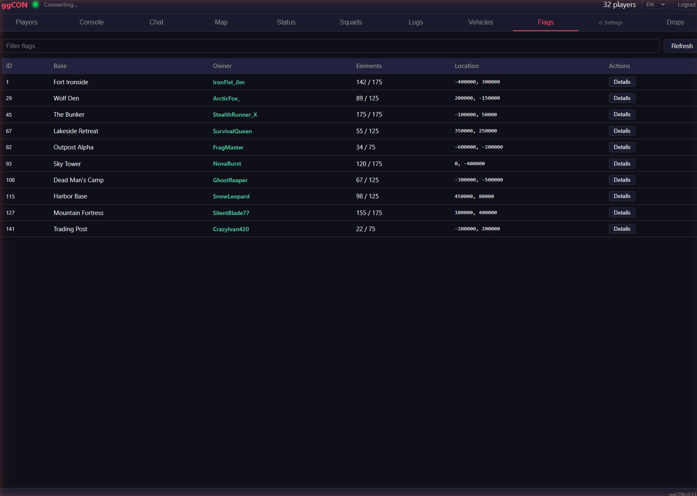

### Squads

Full squad list with member details and management actions.

- **Squad list** — all squads with name, score, member count, and online indicator (green dot when any member is online)
- **Online squads** are sorted to the top
- **Click a squad** to expand and see members with their rank, online/alive/danger status
- **Refresh** — forces a reload of squad data from the database
- **Remove Member** — removes a player from their squad
- **Delete Squad** — removes all members and destroys the squad

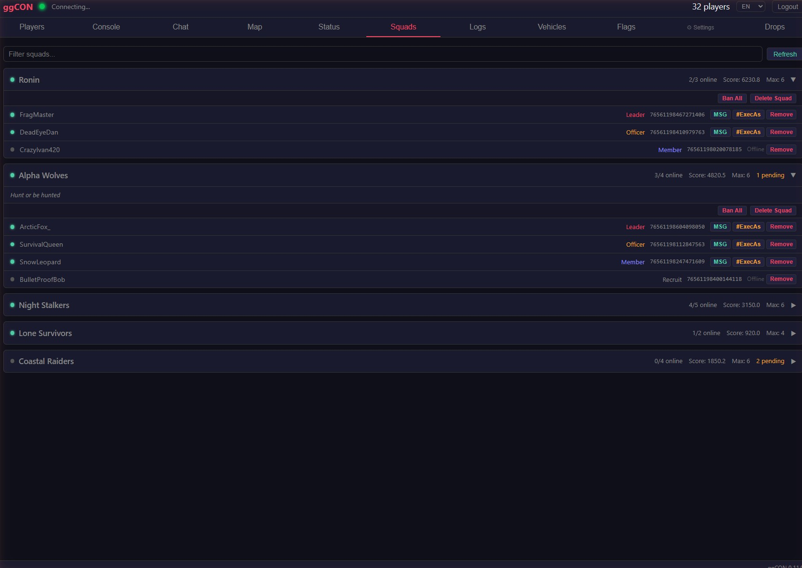

### Logs

Real-time log viewer for SCUM server log files. Requires `LogWatcherEnabled = true`.

- **Source filters** — pill-style buttons to toggle log sources (chat, kill, admin, economy, login, etc.) with color coding
- **Text filter** — type to filter log lines by content
- **SCUM source** — off by default (verbose game engine output)
- **Auto-scroll** — new lines appear at the bottom with automatic scrolling
- **Max 1000 lines** — older lines are pruned as new ones arrive

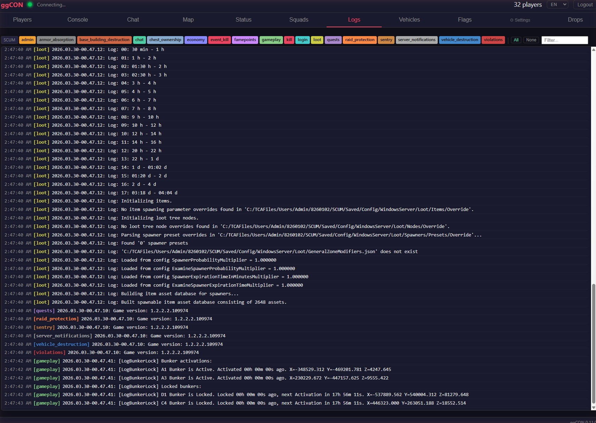

### Status

Server information and live controls:

- SCUM version and ggCON version
- Online player count
- Time of day, weather conditions
- Temperature, wind, humidity, fog, cloud coverage

**Server controls:**

- **Time slider** — drag to set the time of day (0–23 hours) with day/night icons
- **Weather slider** — drag to set weather intensity (0–1) with sun/storm icons

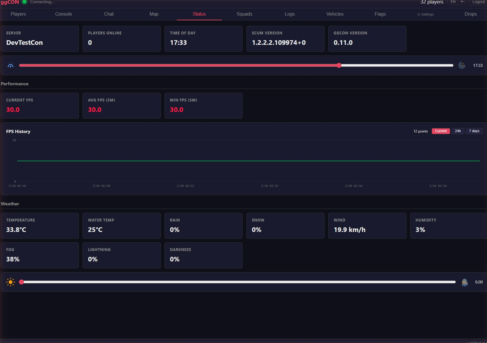

### Plugin Tabs

Loaded plugins that provide a panel tab appear as additional navigation buttons. Click a plugin tab to view its custom UI. See [Plugins](plugins.md) for details.

---

## Settings

Click the **gear icon** in the navigation bar to open the Settings panel.

### Plugins

Manage installed and available plugins. See [Plugins](plugins.md#marketplace) for details.

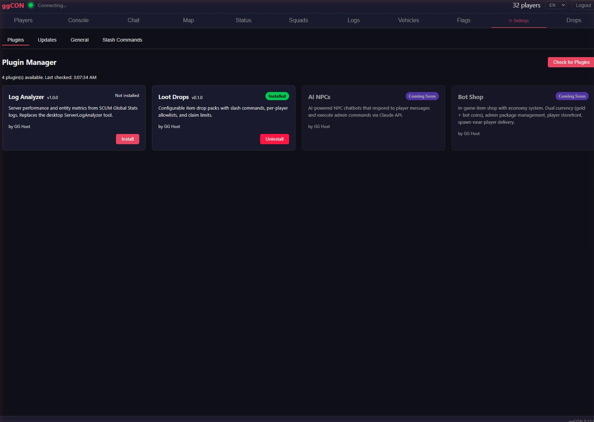

### Updates

Check for ggCON updates and stage them for installation on the next server restart. See [Auto-Update](auto-update.md) for details.

---

## Update Banner

When a new version of ggCON is available, a green banner appears at the top of the panel shortly after login. Click **Stage Update** to download the new version — it will be applied automatically on the next server restart.

---

## Give Item

The **Give Item** button (available in the player detail popup) opens an item picker modal:

1. **Search** — type to instantly search across 6,000+ SCUM items
2. **Category filter** — dropdown to filter by item category
3. **Quantity** — set how many to spawn (default: 1)
4. Click an item to spawn it for the selected player

The item is spawned directly into the player's vicinity. No database modifications are required.

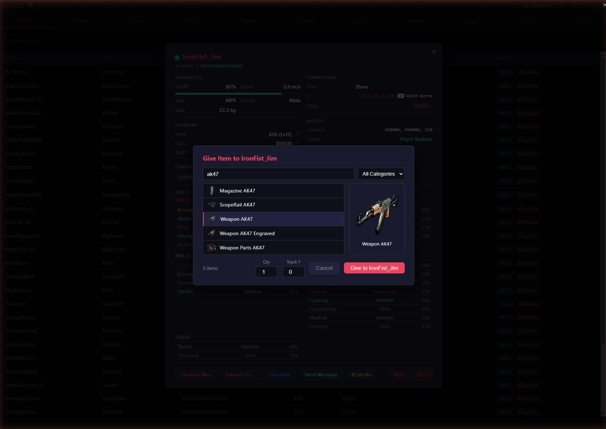

---

## Teleport from Map

The **Teleport To...** button in the player detail popup opens the map in teleport mode:

1. Click **Teleport To...** on any online player
2. The map opens with a red banner showing the target player's name and a **Cancel** button
3. The cursor changes to a crosshair
4. **Click anywhere on the map** to select a destination
5. A confirmation dialog shows the target coordinates — click **OK** to teleport, or **Cancel** to pick a different spot
6. The teleport command executes and the result appears in the Console tab

Press **Escape** or click **Cancel** in the banner to exit teleport mode without teleporting.

---

## #ExecAs Button

The **#ExecAs** button (available in the player list and detail popup) lets you execute an admin command in the context of a specific player. The player's Steam ID is automatically filled in — you just type the command.

For example, clicking #ExecAs on a player and typing `Knockout 10` will execute:

```
#ExecAs 76561198000000003 #Knockout 10
```

This is useful for commands that target a specific player, such as teleporting, spawning items near them, or applying effects.
